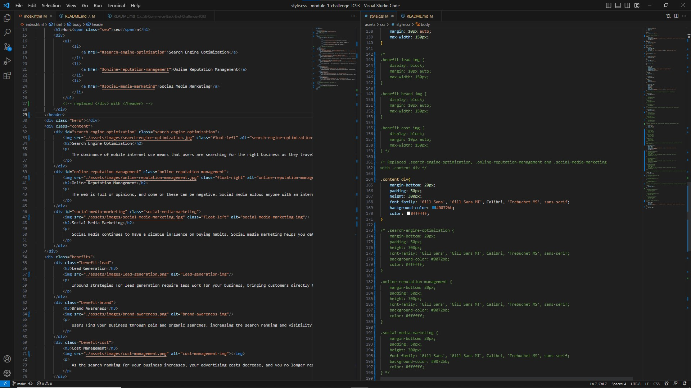

# Horiseon SEO Revisions Challenge

## Technology Used 

| Technology Used         | Resource URL           | 

| HTML | [https://developer.mozilla.org/en-US/docs/Web/HTML](https://developer.mozilla.org/en-US/docs/Web/HTML)      | 
| CSS | [https://developer.mozilla.org/en-US/docs/Web/CSS](https://developer.mozilla.org/en-US/docs/Web/CSS)     |     

## Description

We were assigned the task of revising the index.html and the linked stylesheet (CSS) for a company's website.

## User Story (provided)

AS A marketing agency
I WANT a codebase that follows accessibility standards
SO THAT our own site is optimized for search engines

## Acceptance Criteria (provided)

GIVEN a webpage meets accessibility standards
WHEN I view the source code
THEN I find semantic HTML elements
WHEN I view the structure of the HTML elements
THEN I find that the elements follow a logical structure independent of styling and positioning
WHEN I view the image elements
THEN I find accessible alt attributes
WHEN I view the heading attributes
THEN they fall in sequential order
WHEN I view the title element
THEN I find a concise, descriptive title

## Learning Points

Within index.html... I replaced div containers with semantic tags, added alt texts to the img tags, gave a div an id to fix a broken link.
Within style.css... I replaced .header and .footer with header and footer, and consolidated the .benefits and .content selectors.
In both... I added comments explaining the changes I made, and commented out the code that I consolidated.

## Credits

* [LinkedIn](https://linkedin.com/in/justinchoica)
* [Github](https://github.com/justinschoi93)
* [Email](justinschoi93@gmail.com)
