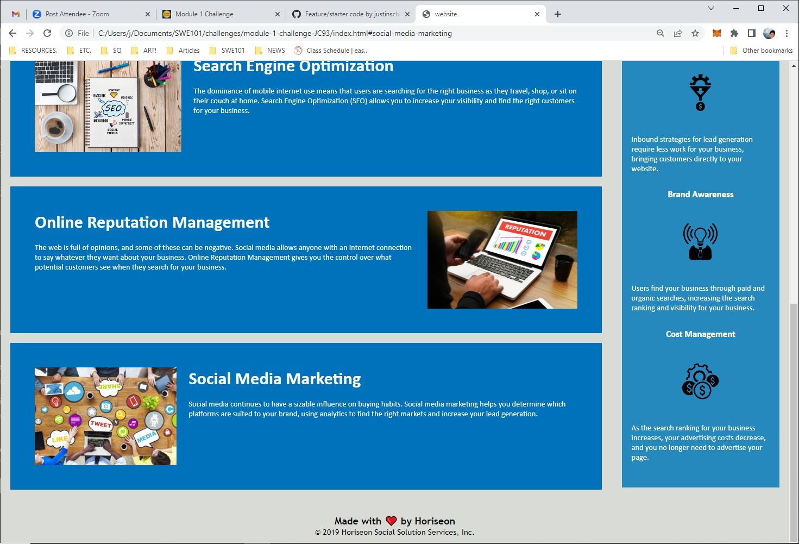

# module-1-challenge-JC93
Justin's Module 1 Challenge 

## Technology Used 

| Technology Used         | Resource URL           | 
| ------------- |:-------------:| 
| HTML    | [https://developer.mozilla.org/en-US/docs/Web/HTML](https://developer.mozilla.org/en-US/docs/Web/HTML) | 
| CSS     | [https://developer.mozilla.org/en-US/docs/Web/CSS](https://developer.mozilla.org/en-US/docs/Web/CSS)      |   

## Description

The provided HTML and CSS files were moved into a designated repository, where they were updated, improved. The CSS code was consolidated, the HTML tags were changed to be more intuitive, and a dead link was fixed. 

## Screenshots

## Learning Points

I learned how to fix dead links, revise HTML tags, and consolidate CSS code. 

## Author Info
Justin Choi
[LinkedIn](https://www.linkedin.com/in/justinchoica/)
[GitHub](https://github.com/justinschoi93)